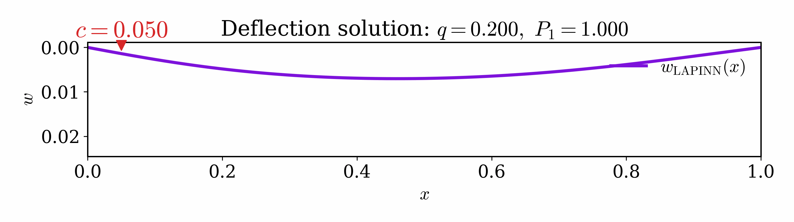
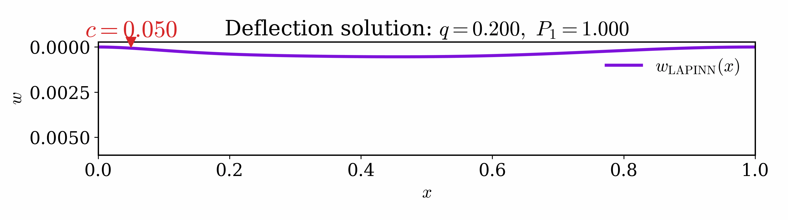

# GA-ePINN

GA-ePINN_clean 是从原始研究工作区中整理出的发布版仓库，面向几何参数化结构力学问题的
几何感知能量物理信息神经网络方法。

这个版本只保留适合公开发布的核心代码、最小示例和必要图片资源，不包含论文返修材料、
训练结果、缓存文件和大型实验产物。

当前仓库主要包含：

- 一维 Euler-Bernoulli 梁模型
- 二维 Kirchhoff 板模型

## 动画展示

### 板：参数化移动荷载响应


### 梁：案例 1



### 梁：案例 2



## 当前包含的主要问题

- 一维梁弯曲问题：`cPINN`、`ePINN`、`mlPINN`
- 长宽比参数化 Kirchhoff 板
- 固定板长的单孔板
- 几何参数化单孔板
- 双孔板

## 仓库结构

```text
GA-ePINN_clean/
  assets/
  examples/
  src/gaepinn/
    beam/
    plate/
```

## 图片资源


## 安装

```bash
pip install -r requirements.txt
```

或者：

```bash
pip install -e .
```

## 快速开始

在仓库根目录运行：

```bash
python examples/run_beam.py
python examples/run_plate_aspect_ratio.py
python examples/run_plate_hole_fixed.py
python examples/run_plate_hole_parametric.py
python examples/run_plate_two_holes.py
```

默认输出写入 `outputs/`。

## 说明

- 原始工作区中的部分评估流程依赖本地 FEM 表格数据，这些数据未随当前发布版一同提供。
- 部分用于评估的 FEM 表格数据由于文件体积较大，未随本仓库发布。如有需要，可联系作者单独索取。
- 当前版本优先保留主要训练代码和最小可运行示例。
- 原始研究工作目录保持不动，作为归档版本单独保留。
