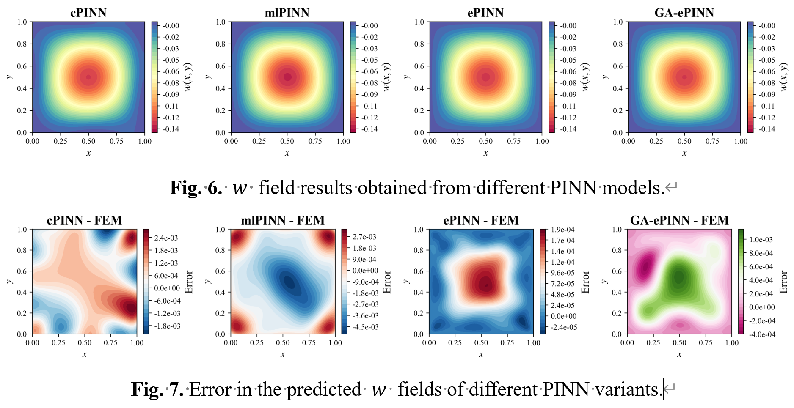

# GA-ePINN

**面向计算力学几何参数化建模的几何感知能量型 PINN**

**摘要：** 现有 Physics-Informed Neural Network（PINN）框架通常依赖于具体几何构型，一旦结构几何发生变化，往往需要重新训练模型，代价较高。本仓库将结构的几何参数直接并入网络输入，使模型只需训练一次，即可在给定参数域内预测任意几何构型下的变形响应。我们将该框架称为 Geometry-Aware energy-based Physics-Informed Neural Network（GA-ePINN），并通过一系列 Kirchhoff 板数值算例进行验证。结果表明，在长宽比参数化问题中，GA-ePINN 在保持平均挠度误差低于 1% 的同时，计算效率可达到有限元方法（FEM）的 10 倍以上；在含内部边界的高维参数化问题中，平均挠度误差也可控制在 3% 以内。该方法发挥了无网格方法的内在优势，适用于高维参数化问题。

本仓库是原始 GA-ePINN 研究工作区的整理发布版本，保留了适合公开发布的主要代码、示例入口和核心可视化资源，同时移除了返修材料、缓存文件、训练输出以及其他不适合公开仓库保留的本地实验产物。

<p align="center">
  
</p>

<p align="center">
  
</p>

<p align="center">
  
</p>

<p align="center">
  
</p>

<p align="center">
  
</p>

## 当前包含的主要问题

- 长宽比参数化 Kirchhoff 板
- 固定板长的单孔板
- 几何参数化单孔板
- 双孔板
- 作为补充保留的一维梁弯曲整理代码

## 仓库结构

```text
GA-ePINN_clean/
  assets/
  examples/
  src/gaepinn/
    beam/
    plate/
```

## 安装

```bash
pip install -r requirements.txt
```

或者：

```bash
pip install -e .
```

## 快速开始

在仓库根目录运行：

```bash
python examples/run_beam.py
python examples/run_plate_aspect_ratio.py
python examples/run_plate_hole_fixed.py
python examples/run_plate_hole_parametric.py
python examples/run_plate_two_holes.py
```

默认输出写入 `outputs/`。

## 说明

- 原始部分评估流程依赖本地 FEM 表格数据，这些数据未随当前发布版一同提供。
- 部分用于评估的 FEM 表格数据由于文件体积较大，未随本仓库发布。如有需要，可联系作者单独索取。
- 原始研究工作目录保持独立保存，当前仓库为整理后的发布版本。
